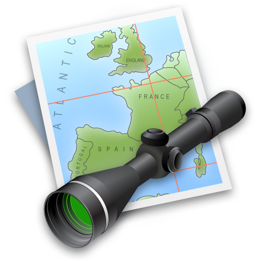
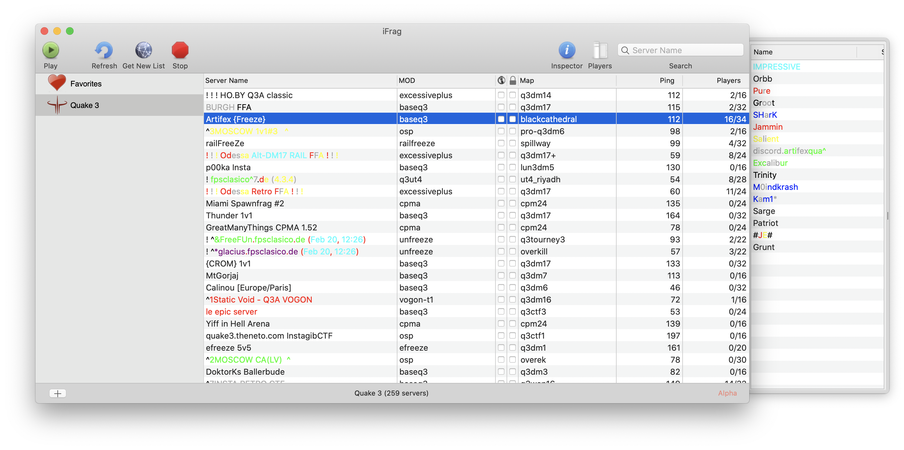

# iFrag

A game server browser for Mac. This was my first attempt at making a Cocoa app 😅

   
  <em>App icon</em>

It supports Quake3, Quake4, Call Of Duty and Wolfenstein: Enemy Territory. You just need to have one of these installed[1](#64bit) on your Mac and it would allow you to browse its servers.

Hey look, an NSDrawer!

<a name="64bit">1</a>: Good luck finding 64bit versions of these games! At least [ioquake3](https://github.com/ioquake/ioq3/issues/418) can still be compiled from source easily.
